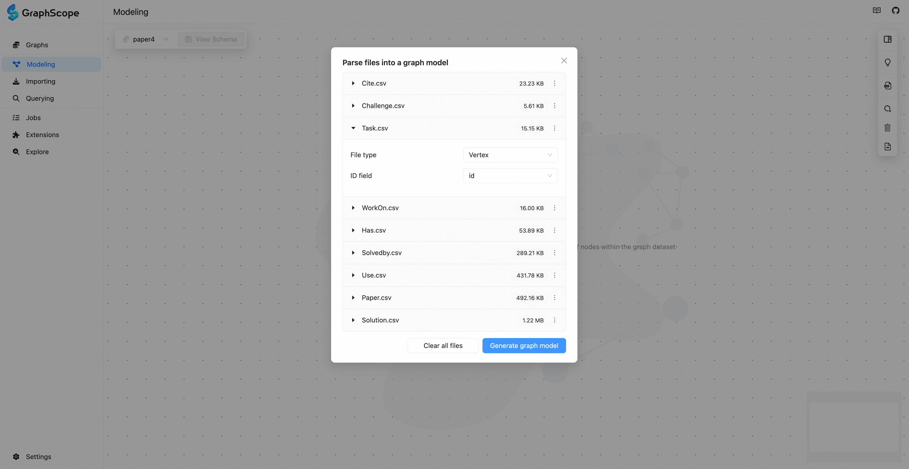
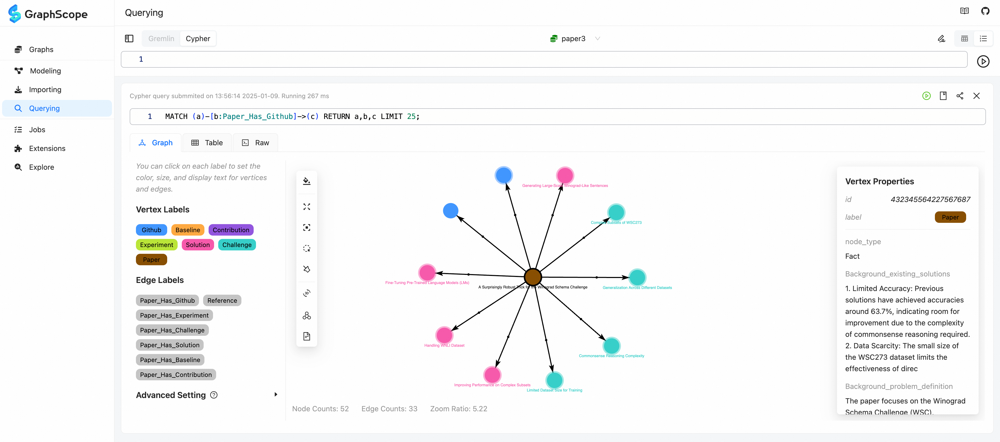

# GraphScope Portal

A web-based management tool for GraphScope

 English | [简体中文](./README.zh-CN.md)

GraphScope Portal is a user-friendly web interface that simplifies managing graph data with GraphScope. It offers one-stop access to data modeling, importing, querying, and monitoring, catering to both Interactive and Insight engines within the GraphScope Flex architecture.


## Try it online

The online address for GraphScope Portal is: https://gsp.vercel.app/#/setting. You will notice that the default API request service for the website is: http://127.0.0.1:8080. This is a Coordinator service provided by the GraphScope Interactive engine, which needs to be started locally. Please follow the script below to run it:

```bash

# Pull the GraphScope Interactive Docker image
docker pull registry.cn-hongkong.aliyuncs.com/graphscope/interactive

# Start the GraphScope Interactive service
docker run -d --name gs -p 8080:8080 -p 7777:7777 -p 10000:10000 -p 7687:7687 registry.cn-hongkong.aliyuncs.com/graphscope/interactive --enable-coordinator --port-mapping "8080:8080,7777:7777,10000:10000,7687:7687"
```

Once started, you can begin using it. In addition, GraphScope Portal can also be launched via Docker, source code, and other methods. Please refer to the [Installation Guide](./docs/interactive/pages/docs/portal/manual/installation.md) for more details.

## Core Features

### Data Modeling

GraphScope Portal supports users in manually constructing graph models. You can create vertex types by clicking "Add Node" or create edge types by "dragging vertex edges." The entire process is like freely sketching on a whiteboard—efficient and simple. Additionally, Portal supports automatically inferring and generating graph models by parsing user CSV, JSON, and other data files.



## Data Importing

GraphScope Portal allows users to bind data files in a single or batch mode according to the vertex-edge model. For CSV files, it provides local upload and field mapping parsing functionality. It also supports one-click data import through YAML configuration files.


### Interactive Querying

Once the data is ready, GraphScope Portal offers the 「Query」 module, which features a powerful code editor, multiple query methods, and rich visualization.

Powerful Editor: Supports syntax completion and highlighting for Cypher / Gremlin, making it easy for users to edit and modify queries.

Multiple Query Methods: Allows users to write and save graph query statements, review history, recommend queries based on schema, and use natural language queries based on OpenAI.

Rich Visualization: Supports both Graph and Table display modes. The Graph mode provides 2D/3D visualization, an efficient rendering engine, and allows users to customize node and edge colors, sizes, fonts, etc. It also supports further data insights through "switching charts."



### Graph Exploration

The graph exploration module is currently in the experimental phase. Therefore, you can manually enable it in 「Settings / Experimental Tools」. This module provides various analysis components such as a search bar, style analysis, layout analysis, statistical analysis, clustering analysis, and table analysis. Users can explore graph data online without the need to write query statements.


### Extensibility

GraphScope Portal offers a 「Extension」 module, supporting the import and use of "Stored Procedures" and "Graph Algorithms" as plugins. It also provides "Personalized Configuration": supports language switching, theme switching, and customization of theme colors and other details.

Its frontend module not only supports use on the Web UI but also integrates with Jupyter Notebook.

## Other Resources

- [ 🔧 Graph Components](https://graphscope.github.io/portal/graphs)

## License

GraphScope Portal is licensed under the [Apache License 2.0](https://www.apache.org/licenses/LICENSE-2.0). Please note that third-party dependencies may not have the same license as GraphScope Portal.
