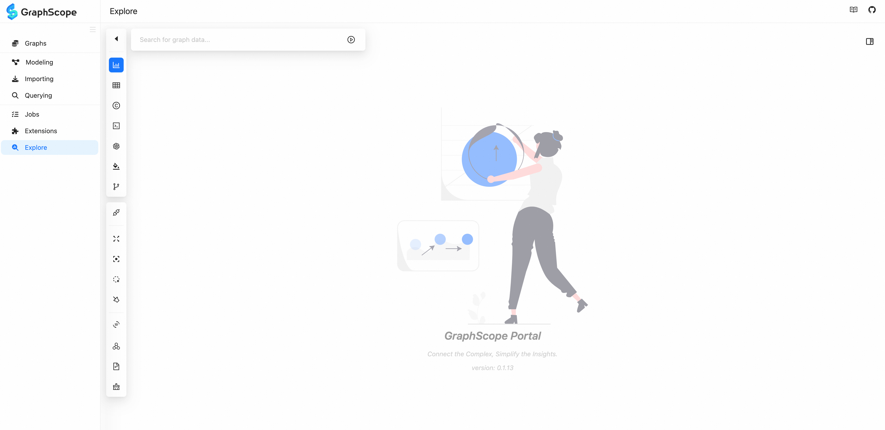
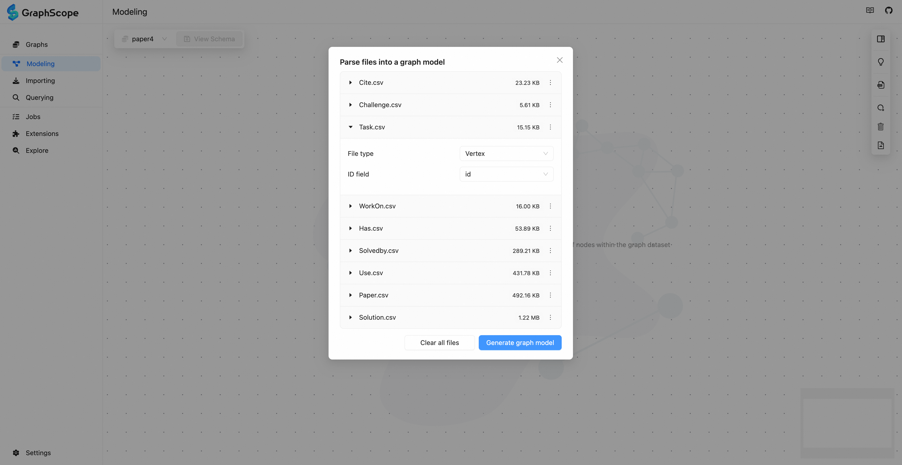
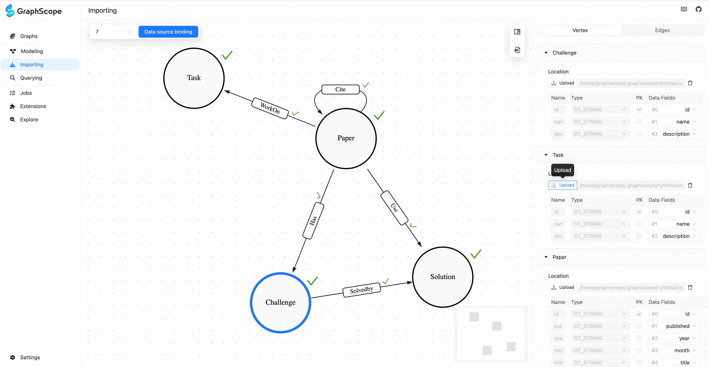
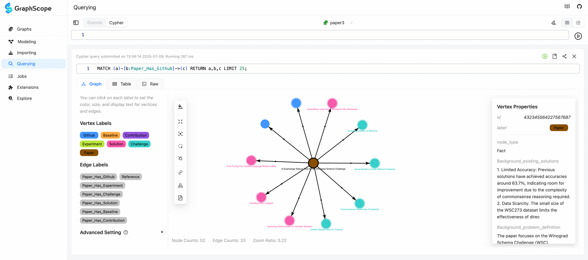
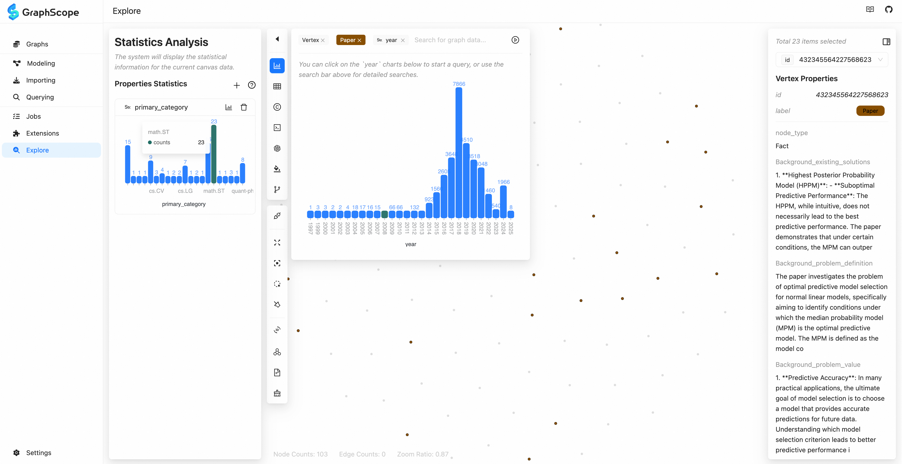

# GraphScope Portal

专为 GraphScope 设计的，基于 Web 的用户交互工具

 [English](/docs/README.md) | 简体中文

GraphScope Portal 是一款专为 GraphScope 设计的，基于 Web 的用户交互工具，旨在一站式简化图数据管理流程。它集成了数据建模、导入、查询与监控功能，全面支持 GraphScope Flex 架构下 Interactive 与 Insight 计算引擎。



## 在线体验

GraphScope Portal 在线体验地址：https://gsp.vercel.app/#/setting ，我们会发现在网站的接口请求服务默认为：http://127.0.0.1:8080 ，这是一个由 GraphScope Interactive 引擎提供的图数据库 Coordinator 服务，需要我们在本地启动，请按照下面脚本运行：

```bash

# 拉取 GraphScope Interactive 镜像

docker pull registry.cn-hongkong.aliyuncs.com/graphscope/interactive:0.29.3-arm64

# 启动 GraphScope Interactive 服务
docker run -d --name gs --label flex=interactive -p 8080:8080 -p 7777:7777 -p 10000:10000 -p 7687:7687 registry.cn-hongkong.aliyuncs.com/graphscope/interactive:0.29.3-arm64 --enable-coordinator

```

启动后，即可开始使用。除此之外，我们还可以通过docker，源码等多种方式启动 GraphScope Portal，请移步阅读[安装指南](./docs/interactive/pages/docs/portal/manual/installation.md)

## 核心功能

### 数据建模

GraphScope Portal 支持用户手动构建图模型，您可以点击「添加节点」创建点类型，也可以通过「拖拽节点边缘」创建边类型。整个过程就像是在白板上自由手绘，高效简洁。同时 Portal 也支持通过解析用户的 CSV,JSON 等数据文件，自动推测生成图模型。



### 数据导入

GraphScope Portal 支持用户手动构建图模型，您可以点击「添加节点」创建点类型，也可以通过「拖拽节点边缘」创建边类型。整个过程就像是在白板上自由手绘，高效简洁。同时 Portal 也支持通过解析用户的 CSV,JSON 等数据文件，自动推测生成图模型。

支持用户按照点边模型，单次或批量绑定数据文件。针对 CSV 文件，提供本地上传并解析字段映射的功能。也支持也支持用过通过 yaml 配置文件一键导入数据



### 交互式查询

当数据准备就绪之后，GraphScope Portal 提供了「交互式查询」模块，该模块拥有强大的代码编辑器，多种查询方式，以及丰富的可视化

- 强大的编辑器：支持 Cypher / Gremlin 的语法补全，高亮，方便用户编辑，修改。

- 多种查询方式：支持用户编写保存图查询语句，回溯历史记录，根据 Schema 推荐查询，和基于 openai 的自然语言查询功能。

- 丰富的可视化：支持 Graph / Table 的两种展示模式，Graph模式支持 2D/3D 展示，高效的渲染引擎，支持用户自定义点边的颜色，大小，字体等样式，也支持通过「切换图表」进一步洞察数据。



### 图探索分析

图探索分析模块，目前还处于实验阶段，因此，您可以现在「设置 / 实验性质工具」中手动开启使用，该模块提供了搜索框，样式分析，布局分析，统计分析，聚类分析，表哥你分析等多种分析组件，用户无需编写查询语句，即可在线探索图数据



### 扩展机制

GraphScope Portal 提供「插件集成」模块， 支持「存储过程」，「图算法」以插件的形式导入并使用，也提供「个性化配置」：支持语言切换，主题切换，支持定制主题色和其他细节。

其前端模块，不仅支持用户在 Web UI 上使用，也支持集成在 Jupyter Notebook 中使用。

## 其他参考

- [ 🔧 图组件库](https://graphscope.github.io/portal/graphs)

## 许可证

GraphScope Portal 采用 Apache License 2.0 开源许可协议发布，鼓励对软件进行修改、分发及商业应用，同时保护贡献者的权益
