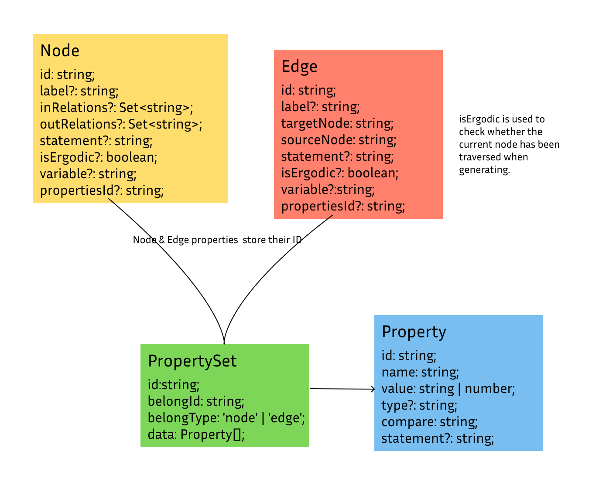

# 📊 `@graphscope/studio-draw-pattern`

This section covers the `DrawPattern` component of the `GraphScope Portal`.

## Data Structure

The following diagram illustrates the data structure design:



### Key Points:

- **Properties**: In both nodes and edges, the properties store the property ID values.
- **isErgodic**: This flag is used to determine whether a node has been traversed during generation.

## Component

### Overview

The `DrawPattern` component is designed to handle graph schema previews and provide an interactive interface for users to define graph patterns using `MATCH`, `WHERE`, and `description` values. It allows custom handling of changes through a callback function and renders a user interface split into two sections: a quick start guide and a canvas for graph visualization.

### Props

#### `previewGraph?: GraphProps`

- **Type**: `GraphProps` (an object containing nodes and edges)
- **Description**: This optional prop allows you to pass in a preview graph, which consists of schema nodes and edges to visualize on the canvas.

**GraphProps Interface**:

```ts
export interface GraphProps {
  nodes: ISchemaNode[];
  edges: ISchemaEdge[];
}
```

- `nodes`: An array of graph nodes (`ISchemaNode`).
- `edges`: An array of graph edges (`ISchemaEdge`).

### `onClick?: (value: DrawPatternValue) => void`

- **Type**: `(value: DrawPatternValue) => void`
- **Description**: An optional callback function that will be triggered when a user action occurs, providing the `MATCH`, `WHERE`, and `description` values.

**DrawPatternValue Interface**:

```ts
export interface DrawPatternValue {
  MATCHs: string;
  WHEREs: string;
  description: string;
}
```

- `MATCHs`: String representation of the graph pattern’s `MATCH` statement.
- `WHEREs`: String representation of the `WHERE` conditions.
- `description`: A string describing the pattern.

### Usage Example

Here’s how you can use the `DrawPattern` component within a React application:

```tsx
import React from 'react';
import { DrawPattern, DrawPatternValue, GraphProps } from './DrawPattern';

const App: React.FC = () => {
  const graphData: GraphProps = {
    nodes: [
      { id: 'node1', label: 'Node 1' },
      { id: 'node2', label: 'Node 2' },
    ],
    edges: [{ source: 'node1', target: 'node2', label: 'Edge 1' }],
  };

  const handlePatternClick = (value: DrawPatternValue) => {
    console.log('Pattern clicked:', value);
  };

  return <DrawPattern previewGraph={graphData} onClick={handlePatternClick} />;
};

export default App;
```

### Explanation

1. **Graph Data**: You pass graph data (`nodes` and `edges`) to the `previewGraph` prop, allowing the component to visualize the graph schema.
2. **Callback**: The `onClick` prop is used to handle changes in graph pattern selection, such as when the user defines a `MATCH` or `WHERE` condition.
