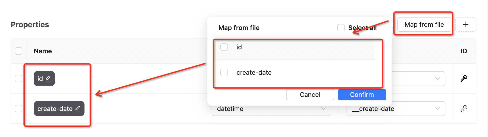
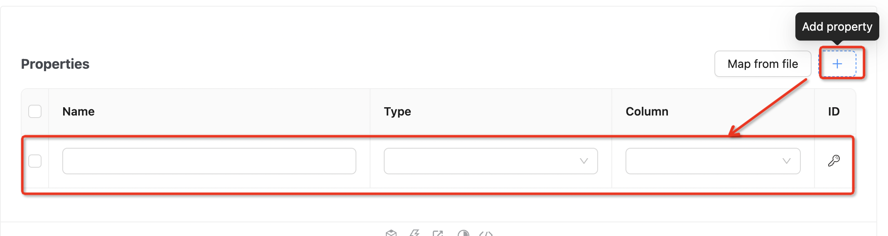
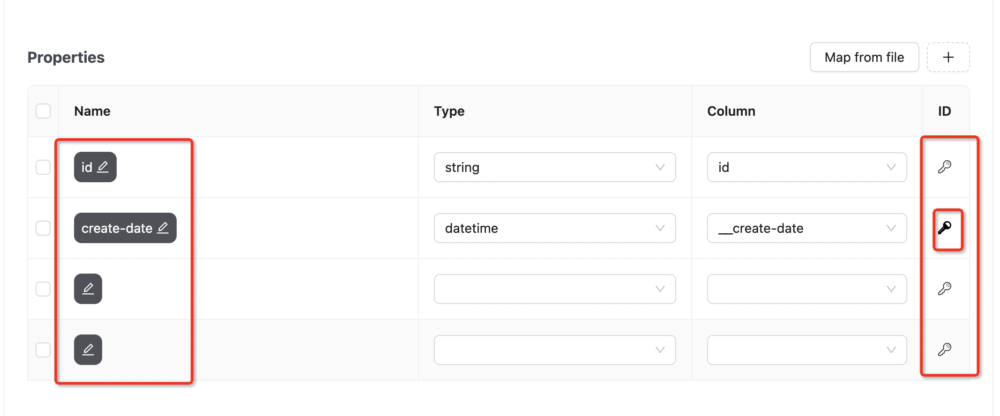

## Hello Studio PropertiesEditor

```bash

      PropertiesEditor 组件 props：
      const properties =[
        {
          id: string | number; # 字符串或数字，用于标识每个属性的唯一性
          name: string; # 字符串，用于表示属性的名称
          type: 'string'; # 字符串，表示属性的数据类型
          token: 'string'; # 字符串
          primaryKey: boolean, # 布尔 属性主键
        }]
      onChange:(values)=>{ console.log(values) # 获取表格实时数据}
      ref:可以通过ref获取表格值
```

```jsx
import React, { useRef } from 'react';
import PropertiesEditor from './index.tsx';
export interface PropertiesType {
    id: string | number,
    name: string,
    type: string,
    token: string,
    primaryKey: boolean,
  }
const properties:PropertiesType[] = [
  {
    id: 1,
    name: 'id',
    type: 'string',
    token: 'id',
    primaryKey: true,
  },
  {
    id: 2,
    name: 'create-date',
    type: 'datetime',
    token: '__create-date',
    primaryKey: false,
  },
];

export default () => {
  const propertiesRef = useRef();
  const getTable = () => console.log('values', propertiesRef.current.getValues());
  const handleChange = values => console.log(values);
  return <PropertiesEditor ref={propertiesRef} properties={properties} onChange={handleChange} />;
};
```


## Properties 
属性面板是图数据展示中非常重要的一个组件。可以逐条添加节点或边的属性配置，也可以上传文件中映射节点或边的属性功能。

### 映射节点或边的属性
 

### 逐条添加属性



### 选择唯一主键,单击修改属性名



