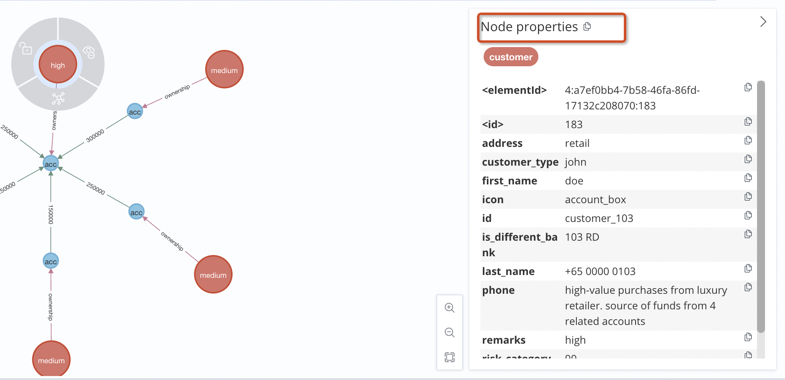
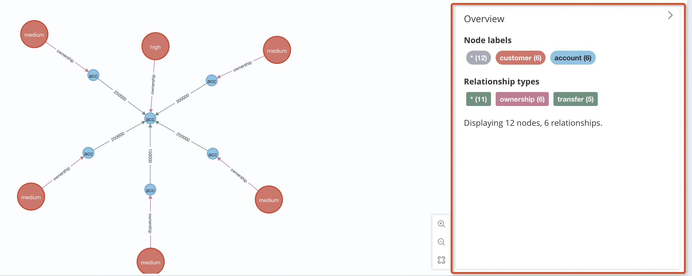
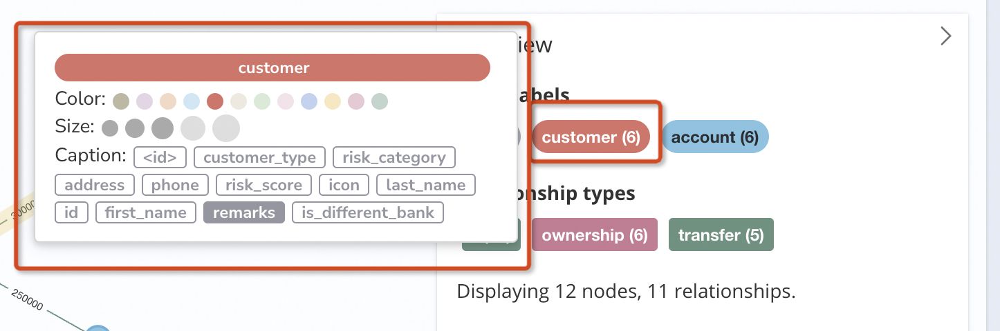
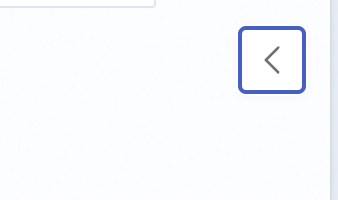

## Usage

```jsx
import PropertiesPanel from './index.tsx';
import { useState } from 'react';
export default () => {
  const [state, updateState] = useState({
    mode: 'overview',
    detail: {
      type: 'node',
      label: 'customer',
      data: {
        id: 'count-1',
        adress: 'AAA',
        phone: 'BBB',
      },
    },
    overview: {
      count: {
        nodes: 12,
        edges: 6,
      },
      schema: {
        nodes: [
          {
            label: 'customer',
            count: 6,
            color: '#F7A128',
            properties: {
              id: 'string',
              address: 'string',
              phone: 'number',
            },
          },
          {
            label: 'account',
            count: 6,
            color: '#40C054',
            properties: {
              id: 'string',
              address: 'string',
              phone: 'number',
            },
          },
        ],
        edges: [
          {
            label: 'ownership',
            count: 6,
            color: '#8DCADD',
            properties: {
              id: 'string',
              address: 'string',
              phone: 'number',
            },
          },
          {
            label: 'transfer',
            count: 5,
            color: '#A413A4',
            properties: {
              id: 'string',
              address: 'string',
              phone: 'number',
            },
          },
        ],
      },
    },
  });
  const handleChangeMode = () => {
    updateState(preState => {
      return {
        ...preState,
        mode: preState.mode === 'overview' ? 'detail' : 'overview',
      };
    });
  };
  const handleChange = values => {
    // 当 legend 改变的时候，设置color，size，caption
  };
  return (
    <div>
      <button onClick={handleChangeMode}>change mode</button>
      <PropertiesPanel {...state} onChange={handleChange} />
    </div>
  );
};
```

## Design

属性面板是图数据展示中非常重要的一个组件。当用户没有与元素交互的时候，它呈现的 Overview 概览信息。当用户点击元素的时候，呈现的则是元素的详细属性信息。我们将这两种交互设定为两种模式：overview 和 detial，下面是对应的组件设计

### Detail 详情



```jsx | pure
const props = {
  type: 'node',
  label: 'customer',
  data: {
    id: 'count-1',
    adress: 'AAA',
    phone: 'BBB',
  },
};
```

### Overview 概览

如下图所示：


- 展示 「Node labels」「Edge labels」「count」信息，其中 NodeLabel 和 EdgeLabel 是由 `Legend` 组件渲染的，交互内容详见 `Legend`

```jsx | pure
const props = {
  count: {
    nodes: 12,
    edges: 6,
  },
  schema: {
    nodes: [
      {
        label: 'customer',
        count: 6,
        color:'#F7A128'
        properties: {
          id: 'string',
          address: 'string',
          phone: 'number',
        },
      },
      {
        label: 'account',
        count: 6,
        properties: {
          id: 'string',
          address: 'string',
          phone: 'number',
        },
      },
    ],
    edges: [
      {
        label: 'ownership',
        count: 6,
        properties: {
          id: 'string',
          address: 'string',
          phone: 'number',
        },
      },
      {
        label: 'transfer',
        count: 5,
        properties: {
          id: 'string',
          address: 'string',
          phone: 'number',
        },
      },
    ],
  },
};
```

### Legend

点击图例，可以 Popover 出来一个自定义设置面板，可以设置 Color，Size，Caption，每次点击设置都会有一个回掉函数


```jsx | pure
const props = OverviewProps.schema;
```

### Container

点击右上角「回退」按钮，可以展开和收起整个面板


