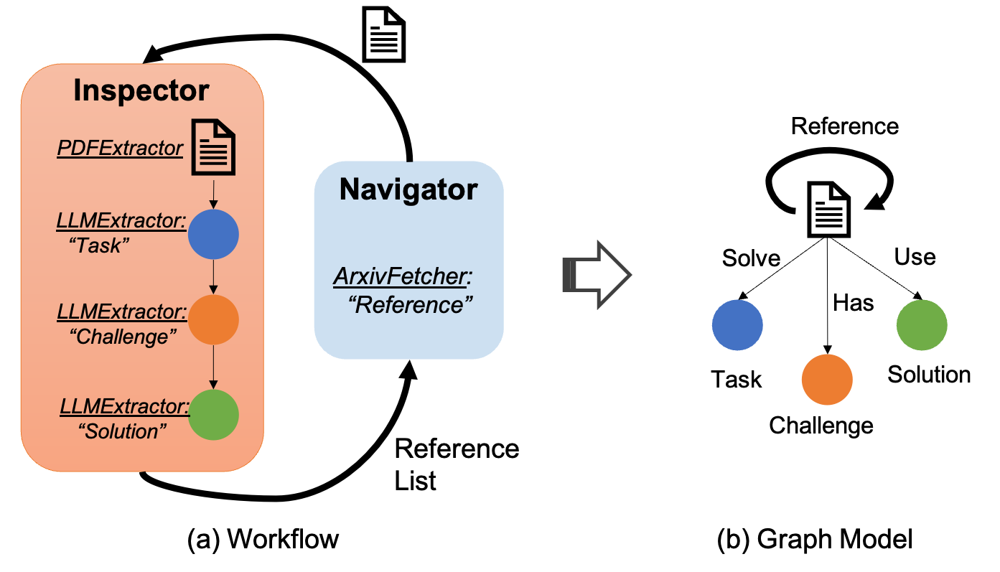

# Graphy'ourData
Have you heard the buzz about the incredible power of large language models (LLMs) and their advanced applications, like Retrieval-Augmented Generation (RAG) or AI Agents? It’s exciting, right? But here’s the real challenge:

> How can you truly empower your existing data with these cutting-edge techniques—especially when your data is mostly unstructured?

Preprocessing unstructured data is often a tedious and time-consuming task. And let’s not forget, building a practical, LLM-based system that can fully leverage the potential of your data? That can be an even bigger hurdle.

**Graphy** is an intuitive end-to-end platform that transforms unstructured data into actionable insights. Unstructured data often hides valuable information, making it difficult to access and utilize. Graphy bridges this gap by leveraging LLMs to effortlessly extract meaningful structures from unstructured data, transforming it into an organized graph format. This enables intuitive visualization, seamless exploration, and powerful LLM-based analysis, unlocking the full potential of your data.



This repository introduces the initial prototype of the Graphy platform, as illustrated above, with a focus on academic papers, which are often publicly accessible. In this prototype, the primary unstructured data consists of research paper PDFs. Graphy’s workflow is built upon two key abstractions:
- **Inspector**: The Inspector abstraction defines the structured information to be extracted from papers. It utilizes an inner Directed Acyclic Graph (DAG), where each subnode represents specific instructions for LLMs to extract targeted information from the paper. This DAG mirrors the commonly referenced ["Tree of Thought"](https://arxiv.org/abs/2305.10601)  pipeline in the LLM literature.
- **Navigator**: The Navigator abstraction determines how related papers can be fetched and processed via the Inspector. Currently, two navigators are available:
    - [Arxiv Fetcher](./utils/arxiv_fetcher.py) for retrieving PDFs from ArXiv.
	- [Google Scholar Fetcher](./utils/scholar_fetcher.py) for fetching PDFs via Google Scholar.

These navigators enable the creation of a rich, interconnected database of academic papers.

## Workflow to Graph Mapping
As illustrated in the figure above, the workflow maps naturally to a structured graph model. In this graph:
	- Primary nodes (or "Fact" nodes) represent papers, containing key extracted information.
	- Connected nodes (or "Dimension" nodes) represent specific pieces of information extracted from the papers by the Inspector.
	- The Navigator links papers to related papers, forming an interconnected web of academic resources.

With this structured database in place, various analyses can be conducted. Our [frontend server](../../examples/graphy/README.md) demonstrates data visualizations, exploration tools, and analytics that support numerous downstream tasks, including tracking research trends, drafting related work sections, and generating prompts for slide creation—all with just a few clicks.

## Potential Extensions

- **Customized Inspector**: The Inspector can be tailored to extract any type of information from paper documents. It can also be extended to handle other types of unstructured data, such as legal documents, medical records, or financial reports.
- **Customized Navigator**: The Navigator can be expanded to fetch data from additional sources, such as PubMed, IEEE, or Springer. Furthermore, navigators could be developed to connect papers to supplementary sources like GitHub repositories, enabling even richer datasets and analyses.


# Install Dependencies

## Prerequisites

- Python 3.10

## Python Dependencies

```bash
python -m venv venv
source venv/bin/activate
pip install -r requirements.txt
```

## Setting Python Environment
We have not built and installed the python package yet. So, it is important to add the path to the python package to the `PYTHONPATH` before running the server.

```bash
export PYTHONPATH=$PYTHONPATH:$(pwd)
```

# Run Offline Paper Scrapper
The provided utility allows you to scrape research papers from arXiv. Using a set of seed papers as input, the scraper can iteratively fetch papers from the references of these seed papers. The process continues until a specified number of papers (`max_inspectors`) has been downloaded and processed.

**Usage**:
```bash
python paper_scrapper.py --max-workers 4 --max-inspectors 500 --workflow <path_to_workflow> <path_to_seed_papers>
```

- `--max-workers` (optional): Specifies the maximum number of parallel workers (default: 4).
- `--max-inspectors` (optional): Defines the maximum number of papers to fetch (default: 100).
- `--workflow` (optional): Path to a workflow configuration file. If not provided, the default configuration file config/workflow.json will be used.
- `<path_to_seed_papers>`: Provide the path containing seed papers. Each paper is a PDF document.

> If no `workflow` provided, a default workflow configuration in `config/workflow.json` will be used.
Ensure that the workflow configuration contains your custom LLM model settings by modifying the "llm_model" field.

# Run Backend Server
A backend demo application is included in this project, accessible as a standalone server.

**Usage**:
```bash
python apps/demo_app.py
```

The server will be running on `http://localhost:9999` by default.

# Run Frontend Server
Please refer to the [frontend README](../../examples/graphy/README.md) for instructions on how to run the frontend server.

# Instruction of Backend APIs

## Dataset

### Create dataset
Create dataset from a single paper, or a zip package of multiple papers. All papers must be in PDF format. We have provided a sample `graphrag.pdf` file in the `input` directory for going through
the demo. The `dataset_id` for this paper is: `8547eb64-a106-5d09-8950-8a47fb9292dc`.

```bash
curl -X POST "http://localhost:9999/api/dataset" -F "file=@inputs/samples/graphrag.pdf"
```

### Get dataset's metadata

Get dataset's metadata by `dataset_id`, including the id, llm_config, and its workflow for extracting the paper, if configured.

```bash
curl -X GET http://0.0.0.0:9999/api/dataset?dataset_id=8547eb64-a106-5d09-8950-8a47fb9292dc
```

### Get all datasets

```bash
curl -X GET http://0.0.0.0:9999/api/dataset
```

### Delete dataset

```bash
curl -X DELETE http://0.0.0.0:9999/api/dataset/8547eb64-a106-5d09-8950-8a47fb9292dc
```

## LLM Config

### Create LLM Config

The LLM model can be configured individually for each dataset (by `dataset_id`), allowing flexibility to use different models based on specific dataset needs. For instance, if cost is a concern, a smaller or locally deployed model can be used for datasets with a large number of papers to optimize expenses.

```bash
curl -X POST http://0.0.0.0:9999/api/llm/config -H "Content-Type: application/json" -d '{
  "dataset_id": "8547eb64-a106-5d09-8950-8a47fb9292dc",
  "llm_model": "qwen-plus",
  "base_url": "https://dashscope.aliyuncs.com/compatible-mode/v1",
  "api_key": "xxx",
  "model_kwargs": {
    "streaming":true
  }
}'
```

We currently offer two options for configuring an LLM model:

- **Option 1: Using OpenAI-Compatible APIs**
This option supports OpenAI and other providers offering compatible APIs. To configure, provide the llm_model, base_url, api_key, and any additional model arguments. The example below demonstrates using OpenAI-compatible APIs through Alibaba’s Dashscope with the qwen-plus model.
- **Option 2: Using Locally Deployed Models with Ollama**
This option supports locally deployed LLM models through Ollama. Set llm_model to `ollama/<ollama_model_name>` to specify a model. For instance, the following settings configure the locally deployed Llama3.1 model (defaulting to 8b) from Ollama:

```bash
curl -X POST http://0.0.0.0:9999/api/llm/config -H "Content-Type: application/json" -d '{
    "dataset_id": "8547eb64-a106-5d09-8950-8a47fb9292dc",
    "llm_model": "ollama/llama3.1",
    "base_url": "http://localhost:11434",
    "model_kwargs": {
        "streaming": true
    }
}'
```


Note: If no LLM model is specified for a dataset, a default model configuration will be applied. To customize this default, open `models/__init__.py` and modify the `DEFAULT_LLM_MODEL_CONFIG` variable.


### Get the LLM Config

```bash
curl -X GET http://0.0.0.0:9999/api/llm/config?dataset_id=8547eb64-a106-5d09-8950-8a47fb9292dc
```

## Workflow Config

### Create the workflow
Create the workflow for extracting contents for all papers in the dataset. The workflow is a acyclic directed graph (RAG). The node of the workflow mainly defines what contents to extract from the paper and the output format. The edge indicates dependencies between nodes.

```bash
curl -X POST http://0.0.0.0:9999/api/dataset/workflow/config -H "Content-Type: application/json" -d '{
    "dataset_id": "8547eb64-a106-5d09-8950-8a47fb9292dc",
    "workflow_json": {
    "nodes": [
        {
            "name": "Paper"
        },
        {
            "name": "Contribution",
            "query":
                "**Question**:\nList all contributions of the paper. These contributions are always organized and listed with a head sentence like **our contributions are as follows**. For each contribution, output the **original representation** and use few words to summarize it.",
            "extract_from": ["1"],
            "output_schema": {
                "type": "array",
                "description": "A list of contributions.",
                "item": [
                    {
                        "name": "original",
                        "type": "string",
                        "description": "The original contribution sentences."
                    },
                    {
                        "name": "summary",
                        "type": "string",
                        "description": "The summary of the contribution."
                    }
                ]
            }
        },
        {
            "name": "Challenge",
            "query": "**Question**:\nPlease summarize some challenges in this paper. Each challenge has summarized NAME, detailed DESCRIPTION and SOLUTION.\n",
            "extract_from": [],
            "output_schema": {
                "type": "array",
                "description": "A list of challenges for the problems and their solutions in the paper.",
                "item": [
                    {
                        "name": "name",
                        "type": "string",
                        "description": "The summarized name of the challenge."
                    },
                    {
                        "name": "description",
                        "type": "string",
                        "description": "The description of the challenge."
                    },
                    {
                        "name": "solution",
                        "type": "string",
                        "description": "The solution of the challenge."
                    }
                ]
            }
        }
    ],
    "edges": [
        {
            "source": "Paper",
            "target": "Contribution"
        },
        {
            "source": "Contribution",
            "target": "Challenge"
        }
    ]
  }
}'
```

### Get the Workflow

```bash
curl -X GET http://0.0.0.0:9999/api/dataset/workflow/config?dataset_id=8547eb64-a106-5d09-8950-8a47fb9292dc
```

## Extraction

Start extracting the paper contents based on the workflow.
This works asynchrously. Once started, one can call the following apis to check the progress.

```bash
curl -X POST http://0.0.0.0:9999/api/dataset/extract -H "Content-Type: application/json" -d '{
 "dataset_id": "8547eb64-a106-5d09-8950-8a47fb9292dc",
 "thread_num": 16
}'
```

Please note that in the extraction process, the `thread_num` parameter is optional, with a default value of 16.

Get the extraction status for all workflow nodes.

```bash
curl -X GET http://0.0.0.0:9999/api/dataset/extract?dataset_id=8547eb64-a106-5d09-8950-8a47fb9292dc
```

Or for a specific node

```bash
curl -X GET "http://0.0.0.0:9999/api/dataset/extract?dataset_id=8547eb64-a106-5d09-8950-8a47fb9292dc&workflow_node_names=Challenge"
```

## Graphy Your Data

After content extraction, the results can be visualized and analyzed within a graph interface. Users can export the graph data as a zip file, which can then be automatically imported and displayed in the [web-based graph visualization tool](../../examples/graphy/README.md).


```bash
curl -X POST http://0.0.0.0:9999/api/dataset/graphy -H "Content-Type: application/json" -d '{
    "dataset_id": "8547eb64-a106-5d09-8950-8a47fb9292dc"
}' --output graph.zip
```

# Tests and Benchmark

The project can be tested by running the following command:

```bash
python apps/demo_app.py  # run the backend app server
pytest -s # on other terminal
```
