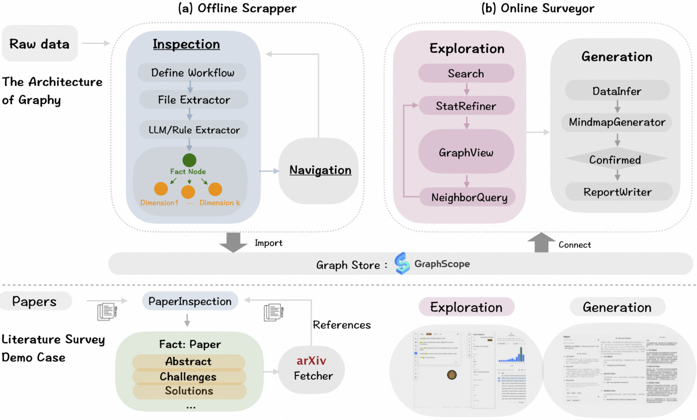
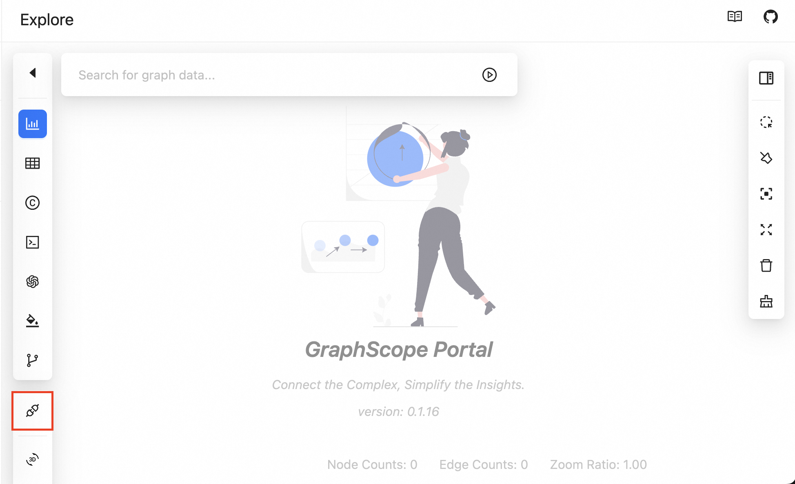

# Graphy'ourdata 🚀

Welcome to the **Graphy** prototype! This repository introduces an innovative platform designed to streamline **iterative exploration and synthesis** of large unstructured data, especially in academic research. Imagine being able to quickly explore, analyze, and synthesize massive networks of papers, all in one place—**Graphy** makes that possible.

## What is Graphy capable of? 🤔

Graphy is designed to make your literature survey process **faster, smarter, and easier**. Whether you're writing related work sections, building academic networks, or conducting a full-blown literature survey, Graphy has got you covered:

- **Write Related Work**: From an already collected set of papers, you can use Graphy to automatically draft a related work section for your own paper. It’s like having an assistant write the first draft for you! ✍️

- **Build an Academic Network**: Start with a few seed papers, and let Graphy help you build a network of academic research. Explore connections, references, and much more. 📚🌐

- **Conduct Literature Survey**: With a pre-built academic network, you can explore related papers, track research trends, and generate a literature survey report based on your research focus. It’s the perfect tool for organizing and synthesizing research findings. 📊

## The Architecture of Graphy 🛠 ️



As shown in the above figure, Graphy is designed with two main components that work together to streamline your research workflow: **Offline Scrapper** and **Online Surveyor**.

The **Offline Scrapper** is responsible for gathering and organizing data from research papers into a structured graph. It has two key abstractions:
- **Inspector**: Extracts essential information from each paper, such as challenges or solutions. Each paper is modelled as a **fact node**, while its extracted information is organized into **dimension nodes**.
- **Navigator**: Expands the network by following references from one paper to others, connecting them into a **fact node** network.

The **Online Surveyor** is where the real exploration happens. Once the papers are organized in the offline stage, this tool lets you:
- **Search and navigate** through the network and **Explore connections** between papers, based on your focus or research interest.
- **Generate insights** for writing your literature survey or related work sections.


## Getting Started with the Offline Scrapper

**Prerequisites:**

- Python 3.10+

- Install Python Dependencies

  ```bash
  python -m venv venv
  source venv/bin/activate
  pip install -r requirements.txt
  ```

- Setting Python Environment: We have not built and installed the python package yet. So, it is important to add the path to the python package to the `PYTHONPATH` before running the server.

  ```bash
  export PYTHONPATH=$PYTHONPATH:$(pwd)
  ```

The provided utility allows you to scrape research papers from arXiv. Using a set of seed papers as input, the scraper can iteratively fetch papers from the references of these seed papers. The process continues until a specified number of papers (`max_inspectors`) has been downloaded and processed. The paper scrapper supports interruption and can be safely terminated at any time. When relaunched, it will resume from where it stopped, ensuring continuity without reprocessing already completed tasks.

**Usage**:
```bash
python paper_scrapper.py --max-workers 4 --max-inspectors 500 --workflow <path_to_workflow> <path_to_seed_papers>
```

- `--max-workers`, or `-w` (optional): Specifies the maximum number of parallel workers (default: 4).
- `--max-inspectors`, or `-i` (optional): Defines the maximum number of papers to fetch (default: 100).
- `--workflow`, or `-f` (optional): Path to a workflow configuration file. If not provided, the default configuration file [`config/workflow.json`](config/workflow.json) will be used. Details on configuring a workflow are provided below.
- `--max-queue-size`, or `-q` (optional): Defines the maximum tasks that can be queued (default: 1000). If the memory is limited, reduce this value.
- `<path_to_seed_papers>`: Provide the path containing seed papers. Each paper is a PDF document.

### Workflow Settings
Refer to an [example](config/workflow.json) for a workflow with Paper Inspector and Reference Navigator. Below are instructions on the following key fields in a workflow: `id`, `llm_config`, and `graph`.

#### The `id` field
The `id` field uniquely identifies the workflow. This can be any descriptive string or a generated ID.

**Example**:
```json
"id": "test_paper_inspector"
```

#### The `llm_config` field
The `llm_config` field configures the large language model (LLM) used in the workflow
  - `llm_model`: Specifies the LLM (e.g., qwen-plus).
  - `base_url`: The API endpoint for the LLM service.
  - `api_key`: The API key for authentication (if required).
  - `model_kwargs`: Additional parameters for fine-tuning the model behavior, such as temperature and streaming output.

We currently offer two options for configuring an LLM model:
- **Option 1: Using OpenAI-Compatible APIs**
This option supports OpenAI and other providers offering compatible APIs. To configure, provide the llm_model, base_url, api_key, and any additional model arguments. The example below demonstrates using [OpenAI](https://platform.openai.com/), Alibaba’s [DashScope](https://help.aliyun.com/zh/dashscope/developer-reference/compatibility-of-openai-with-dashscope), and [DeepSeek](https://www.deepseek.com/).

    **Example of OpenAI**:
    ```json
    "llm_config": {
        "llm_model": "gpt4o",
        "base_url": "https://api.openai.com/v1",
        "api_key": "xx",
        "model_kwargs": {
            "temperature": 0,
            "streaming": true
        }
    }
    ```

    **Example of DashScope**:
    ```json
    "llm_config": {
        "llm_model": "qwen-plus",
        "base_url": "https://dashscope.aliyuncs.com/compatible-mode/v1",
        "api_key": "xx",
        "model_kwargs": {
            "temperature": 0,
            "streaming": true
        }
    }
    ```

    **Example of Deepseek**:
    ```json
    "llm_config": {
        "llm_model": "deepseek-chat",
        "base_url": "https://api.deepseek.com/v1",
        "api_key": "xx",
        "model_kwargs": {
            "temperature": 0,
            "streaming": true
        }
    }
    ```

- **Option 2: Using Locally Deployed Models with Ollama**
This option supports locally deployed LLM models through [Ollama](https://ollama.com/). Set llm_model to `ollama/<ollama_model_name>` to specify a model. For instance, the following settings configure the locally deployed Llama3.1 model (defaulting to 8b) from Ollama:

    **Example**:
    ```json
    "llm_config": {
        "llm_model": "ollama/llama3.1",
        "base_url": "http://localhost:11434",
        "model_kwargs": {
            "streaming": true
        }
    }
    ```


> Note: If no LLM model is specified for a dataset, a default model configuration will be applied. To customize this default, open [`models/__init__.py`](models/__init__.py) and modify the `DEFAULT_LLM_MODEL_CONFIG` variable.


#### The `graph` field
The graph field defines the structure of the workflow, comprising inspectors and navigators.

##### Inspectors

- Inspectors define workflows for extracting structured information from unstructured data.
- Each inspector can contain a graph (an inner workflow) with:
    - nodes: Represent individual extraction tasks.
	- edges: Define dependencies between nodes.

We further explain the `extract_from` field for a node within an Inspector, which specifies where to extract the given information in a paper:
- `exact`: Explicitly defined page numbers or sections. Such as `{"exact": ["1"]}` means searching in Section 1.
- `match`: Keywords to search for relevant sections. Such as `"match": ["introduction"]` means searching for sections
  semantically like "Introduction".
- `exact` and `match` fields can both present in `extract_from`.
- If `extract_from` is omitted or empty, the entire document will be searched.

**Example of a Node within paper Inspector**:
```json
{
  "name": "Background",
  "query": "**Question**: Please describe the problem studied in this paper...",
  "extract_from": {"exact": ["1"], "match": ["introduction"]},
  "output_schema": {
    "type": "single",
    "description": "The background of this paper",
    "item": [
      {
        "name": "problem_definition",
        "type": "string",
        "description": "The problem studied in this paper."
      },
      {
        "name": "problem_value",
        "type": "string",
        "description": "Why the problem is worth studying."
      },
      {
        "name": "existing_solutions",
        "type": "string",
        "description": "What are the existing solutions and their problems."
      }
    ]
  }
}
```

##### Navigators
Currently, the only thing to configure in a navigator is the connected Inspector nodes. The following
most simple navigator configuration uses `PaperNavigateArxivEdge` by default.

**Example**:
```json
{
    "name": "Reference",
    "source": "PaperInspector",
    "target": "PaperInspector"
}
```

To configure using `PaperNavigateScholarEdge` and `PaperNavigatePubMedEdge`, a 'method' field of value 'scholar' and 'pubmed' should be added, respectively.
Please use `PaperNavigateScholarEdge` with caution that it may violate Google Scholar's terms of service,
and can be blocked if used excessively.

```json
{
    "name": "Reference",
    "source": "PaperInspector",
    "target": "PaperInspector",
    "method": "scholar" // or "pubmed"
}
```

> The `navigators` can be left empty, as in [workflow_inspector](config/workflow_inspector.json),
which will only process Paper Inspector without Reference Navigator.

The scraped data will be saved in the directory specified by [WF_OUTPUT_DIR](config/__init__.py), under a subdirectory named after your workflow ID (`<your_workflow_id>`).
- If the default workflow configuration is used, the workflow ID is `test_paper_scrapper`.


## Getting Started with the Online Surveyor 🔍

The simplest way to try out the **Online Surveyor** is via the [Vercel deployment](https://gsp.vercel.app/).
> **Note:** A VPN may be necessary to access this page from China mainland.

For local deployment, follow the instructions in the [GraphScope portal repository](https://github.com/GraphScope/portal/tree/main). Make sure to enable the experimental **Explore** feature in the portal configuration, as shown below:


### For Small Datasets: All In the Browser 🌐
For small datasets, we allow users to import the graph data into [kuzu-wasm](https://unswdb.github.io/kuzu-wasm/guide/what-is-kuzu-wasm.html). This tool provides a [browser-based interface](https://gsp.vercel.app/#/explore) for exploring and analyzing graph data.

First, parse the scraped data into a graph format using the following command:

```bash
python graph_builder.py -i WF_OUTPUT_DIR -o <your_output_dir>
```

A `_graph` folder can be found in `<your_output_dir>` containing the graph data in CSV files.


Then go to the **Explore** page, from the left sidebar, click on the following toggle for importing graph data.



On the prompted page, drag and drop the generated graph data files from the `_graph` folder into the right canvas as instructed. Once the data is loaded, you can Click on "Load CSV Files with Kuzu WASM" to proceed.


### For Larger Datasets: Using GraphScope Interactive 🚀

For larger datasets, we recommend using **[GraphScope Interactive](https://graphscope.io/docs/latest/flex/interactive_intro)**, which supports advanced features such as graph-algorithm support and **[record-breaking](https://ldbcouncil.org/benchmarks/snb/LDBC_SNB_I_20240514_SF100-300-1000_graphscope.pdf)** graph-query performance.

**Installing GraphScope Interactive**

To leverage the power of GraphScope Interactive, you will need to follow the [installation instructions](https://graphscope.io/docs/latest/flex/interactive/installation) to install and start the GraphScope Interactive service.

Once the service is up and running, parse the scrapped data and import it into GraphScope using the following command:

```bash
python graph_builder.py
      -i WF_OUTPUT_DIR
      -o <your_output_dir>
      -g <graph_instance_name>
```

The `<graph_instance_name>` is a unique name for the graph instance in GraphScope.

> Note: When the data has already been parsed and saved in `<your_output_dir>`, you do not need to specify the `-i` options in the above command, which will skip the parsing process.

You can check whether the graph instance is successfully created and running in GraphScope Interactive by clicking on the "Graphs" tab in the left page of GraphScope portal, as shown below:


## Why is Graphy Needed?

Real-world investigative workflows require **iterative exploration and synthesis** of vast unstructured data—something that traditional tools or existing AI models just can't handle.

Take the literature survey process, for example:
1. **Start with a topic of interest**.
2. **Identify seed papers** and start exploring.
3. **Iterate** through key sections of each paper—like "Abstract," "Challenges," and "Solutions"—and expand your network by exploring references.
4. Finally, **synthesize your findings** into a well-organized literature survey report.

This multi-step, dynamic process requires **flexibility, control, and organization**—none of which traditional RAG-based solutions or AI agents provide effectively. Existing solutions often:
- Struggle with maintaining consistency across large, complex networks.
- Lack support for **iterative user oversight**, which researchers rely on for accuracy and control.
- **Propagate errors** in long AI pipelines, especially when dealing with large volumes of data.

Graphy overcomes these hurdles, making it easier for researchers to get reliable, consistent results throughout their exploration.

## Graphy Can Be Extended to Other Scenarios 🚀

While this prototype focuses on academic literature surveys, the core functionality of Graphy is **domain-agnostic**. The same principles apply to:
- **Financial Reports**: Explore and analyze financial documents for trends, predictions, and correlations.
- **Legal Briefs**: Build a network of legal cases and rulings for deeper insights.
- **Healthcare Research**: Analyze medical literature, track treatments, and synthesize results for new studies.

Basically, **any unstructured data set** can benefit from Graphy’s iterative exploration and structured reporting approach.


