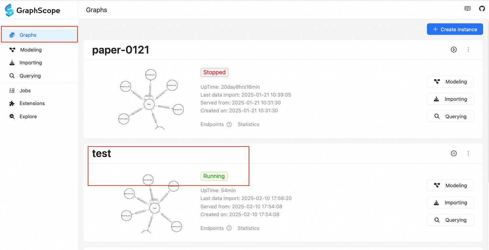
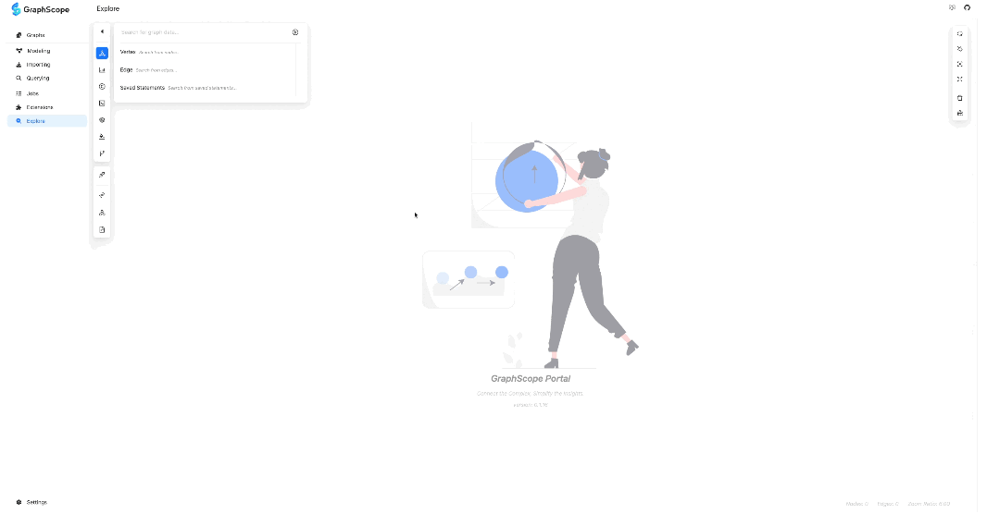
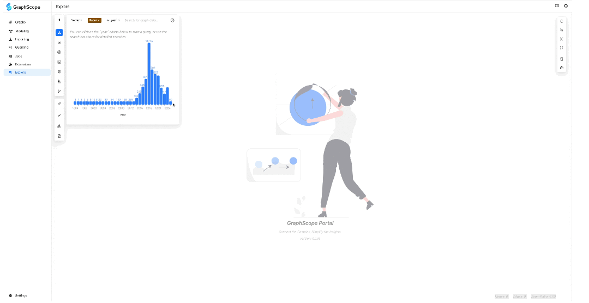
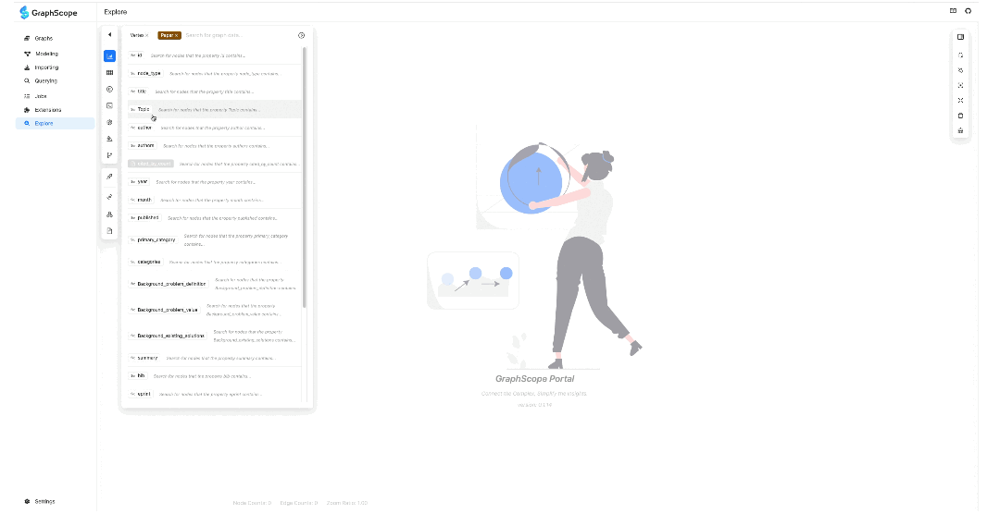

# Tutorial of Building Academic Network

This tutorial walks you through the process of building an academic network using Graphy's **Offline Scrapper** tool.
We have pre-scrapped an academic network comprised of 50000+ papers and 130000+ references from [arxiv](https://arxiv.org/) for testing purpose. The dataset is available [here](https://graphscope.oss-cn-beijing.aliyuncs.com/graphy/arxiv_paper_graph.zip).

## Prerequisites

- We have tested the code on MacOS 14 & 15 and Ubuntu 20.04. The code has better compatibility with Unix and Linux systems. Windows 10 & 11 users are recommended to use WSL2 or a virtual machine.

- If you have not used Graphy before, you will have to prepare for the installation of necessary package.
  - Make sure your Python version >= 3.9 and < 3.13.
  - Make sure you are in the root directory of the Graphy project.
  - Install Python Dependencies

    ```bash
    python -m venv venv
    source venv/bin/activate
    pip install -r requirements.txt
    ```

  - Setting Python Environment: We have not built and installed the python package yet. So, it is important to add the path to the python package to the `PYTHONPATH` before running the server.

    ```bash
    export PYTHONPATH=$PYTHONPATH:$(pwd)
    ```

  - We require Docker to be installed on your machine for starting GraphScope Interactive. Please refer to the [official Docker installation guide](https://docs.docker.com/get-docker/) for detailed installation guide.


## Step 1: Extract Papers

Suppose that you have already prepared a collection of papers for constructing the academic network.
Using these papers as seeds, the **Offline Scrapper** will automatically crawl the references of the papers
for PDFs (and their metadata). The process continues recursively until users terminate the scrapper,
or a given number (**roughly**) of papers have been collected.  Prepare the seed paper PDF files in a directory, and run:

```bash
python paper_scrapper.py  \
  -w 8 \
  -i 1000000 \
  -q 100000 \
  <path_to_your_seed_papers>
```

Parameters:
- The `-w` flag specifies the number of workers to use for the scrapper.
- The `-i` flag specifies the maximum number of papers to be collected.
- The `-q` flag specifies the maximum number of papers (tasks) to be queued for processing.

The scrapper will consume a large amount of LLM tokens. If you have a limited budget of using LLM,
 you can deploy local LLM using [ollama](https://ollama.com) and use the locally deployed LLM by specifying the `llm_config` field in the [default workflow](config/workflow.json), as
  ```json
  {
    "llm_config": {
        "llm_model": "ollama/llama3.1",
        "base_url": "http://localhost:11434",
        "model_kwargs": {
            "streaming": true
      }
    }
  }
  ```

> **NOTE**: The scraping process takes approximately 30 seconds to inspect a single paper using the [default workflow](config/workflow.json). For larger collections, be prepared for longer running times based on the number of papers you wish to collect.

## Step 2: Build and Import Graph Data to GraphScope Interactive
After completing paper scrapping, you will have the raw extracted data maintained under
[WF_OUTPUT_DIR](config/__init__.py)/test_paper_inspector.

Given now you may have a large amount of data, you can use [GraphScope Interactive](https://graphscope.io/docs/latest/flex/interactive/overview) to store the data.

Starting the GraphScope Interactive service **if you haven't done so already**:

```bash
pip install gsctl
gsctl instance deploy --type interactive
```

Then you can build the graph data and import it into GraphScope Interactive by running:
```bash
python graph_builder.py \
  -i WF_OUTPUT_DIR/test_paper_inspector \
  -o <your_output_dir> \
  -g <your_graph_instance_name>
```

> **Note**: If the graph has already been built in `<your_output_dir>`, you can directly import the graph data into GraphScope Interactive without specifying the `-i` flag in the above command.

## Step 3: Get Started with the Online Surveyor

The "Online Surveyor" is a part of the GraphScope web portal, which allows users to explore the graph data interactively. The simplest way to launch the web portal is via the [Vercel deployment](https://gsp.vercel.app/).
> **Note:** A VPN may be necessary to access this page from China mainland.

In the "Graphs" page of the web portal, you can view a list of all graphs that have been imported into Interactive. You should see the graph instance you just imported listed as "Running." Additionally, you can stop or delete the graph instance from this page.


Make sure to enable the experimental **Explore** feature of the web portal:


## Step 4: Start Exploring the Academic Network

You can initiate your exploration by utilizing the search bar. From the options available, select "Vertex" and then choose "Paper". This action will trigger the appearance of a dropdown list, which displays the various attributes associated with the "Paper" node.

To begin your analysis, a good starting point is to explore the distribution of papers over the years. To do this, locate and select the "year" attribute from the dropdown list. Next, you'll notice a "setting" toggle. Click on this toggle to add the "year" attribute for statistical analysis. This step enables you to gather insights into the number of papers published each year. Once you've completed these settings, return to the search section. Click on "year" again, and you will be presented (from now on) with a histogram that vividly illustrates the distribution of papers by year.




You can select specific bars to filter out the papers published within the selected years. The papers that match the filter criteria will be displayed on the canvas. To perform multiple selections or unselect bars, simply hold down the "Shift" key for making/undoing your selections.


Another valuable searching feature is the arbitrary match function. You can select either the "title" or "Topic" of a paper and then enter specific "keywords" into the search box. This will filter out the papers that contain those keywords within their title or topic. The papers matching the filter criteria will be displayed on the canvas.



## Step 5: What are NEXT?
