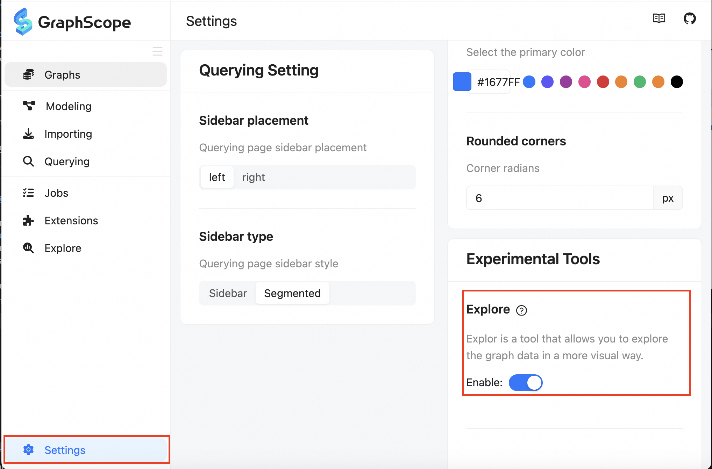
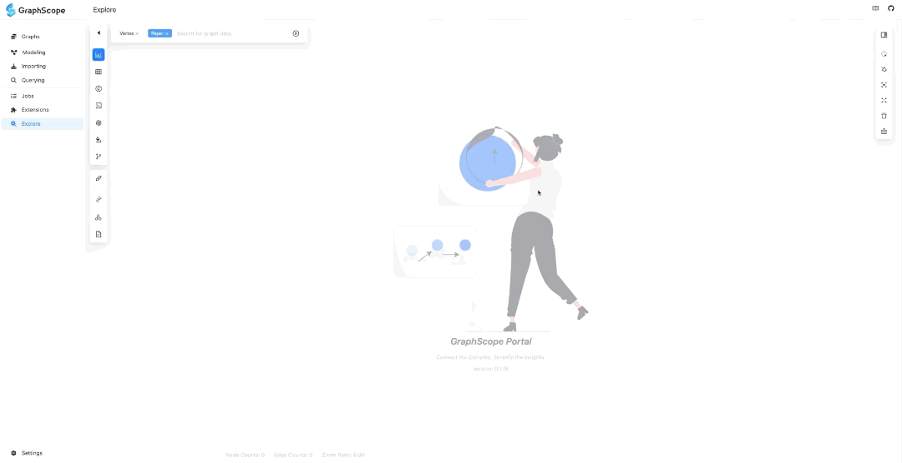
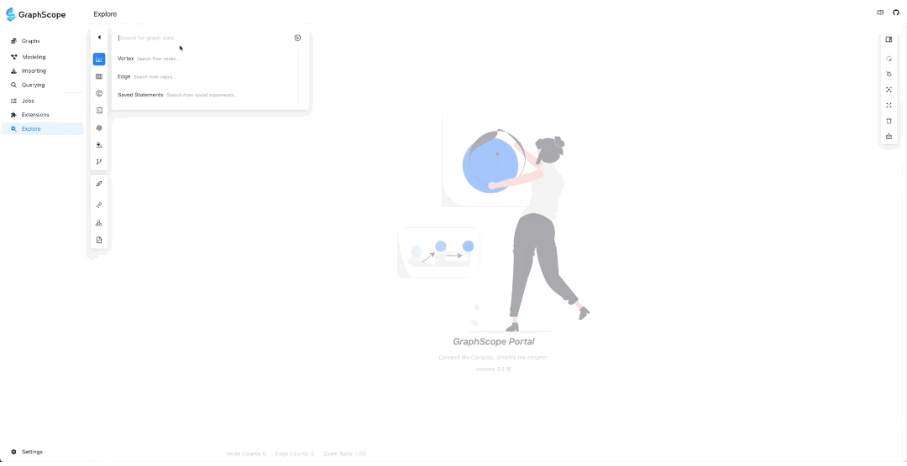
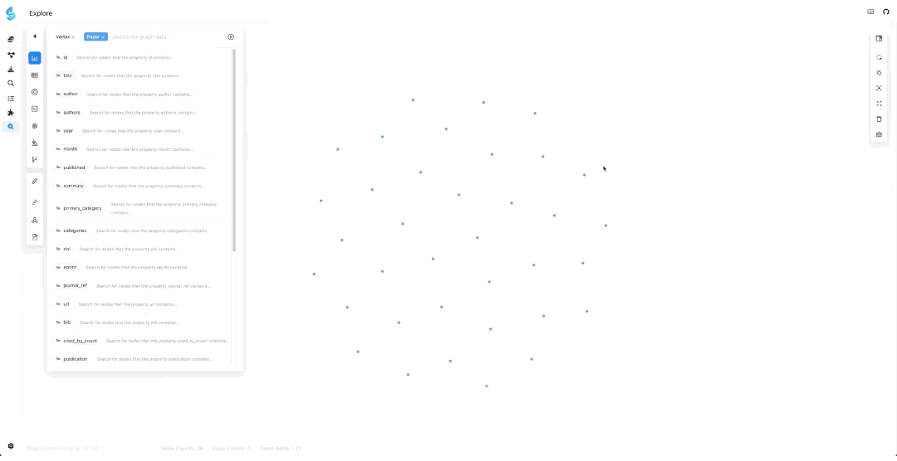
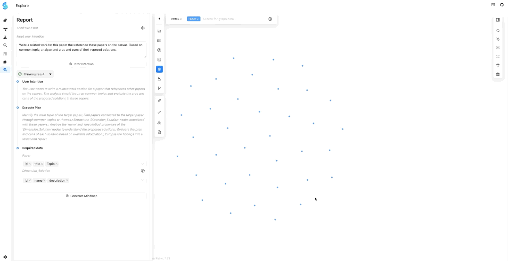

# Tutorial of Writing Related work

## Prerequisites

- We have tested the code on MacOS 14 & 15 and Ubuntu 20.04. The code has better compatibility with Unix and Linux systems. Windows 10 & 11 users are recommended to use WSL2 or a virtual machine.

- Make sure your Python version >= 3.9 and < 3.13.

- Install Python Dependencies

  ```bash
  python -m venv venv
  source venv/bin/activate
  pip install -r requirements.txt
  ```


  > **Note**: You can skip installing the python dependencies if you have already installed the package.


- Setting Python Environment: We have not built and installed the python package yet. So, it is important to add the path to the python package to the `PYTHONPATH` before running the server.

  ```bash
  export PYTHONPATH=$PYTHONPATH:$(pwd)
  ```

## Step 1: Extract Papers

Suppose that you have already prepared a collection of papers for drafting the ``Related Work'' section
for your paper. Prepare the paper PDF files  in a directory, and run:

```bash
python paper_scrapper.py  \
	-w 4 \
	-f config/workflow_inspector.json \
 	<path_to_your_papers>
```

> **Note**: We have configured a workflow that includes only `Inspection` by specifying `config/workflow_inspector.json`. In this task, since we have already identified all the required papers, there is no need to use `Navigation` to crawl the references of the papers.


## Step 2: Build the Graph Data
After completing paper scrapping, you will have the raw extracted data maintained under
[WF_OUTPUT_DIR](config/__init__.py)/test_paper_inspector. Then you can build the graph data by running:

```bash
python graph_builder.py \
  -i WF_OUTPUT_DIR/test_paper_inspector \
  -o <your_output_dir>
```

## Step 3: Import the Graph Data into Kuzu-wasm

The simplest way to try out the **Online Surveyor** is via the [Vercel deployment](https://gsp.vercel.app/).
> **Note:** A VPN may be necessary to access this page from China mainland. Make sure to enable the experimental **Explore** feature in the portal configuration, as shown below:



Then follow the instructions below to import the above graph data



## Step 4: Exploring all Papers

In the graph exploration search dropdown, select "Paper". Then return to the search box, and click "Enter" while the input is empty. This will add all paper nodes to the "Present" canvas.



## Step 5: Prompt to Generate Report

Click the "GPT" logo for "Report Generation" (please select an LLM and configure your API key), enter your intent (prompt), and the LLM will recommend the required data from the graph based on your intent.



## Step 6: Check the Data Recommended by the LLM

Check the data recommended by the LLM, adjust the attributes of paper node, and add dimension nodes (make sure to add dimension nodes here, otherwise the LLM will make up information if it doesn't have the corresponding data!!).



## Step 7: Review the Generated Mindmap

Check the corresponding node data in the graph through the generated mindmap. Once you confirm there are no issues, click "Generate Report".


## Step 8: Write the Related Work
After the report is generated, you can review the report and download the corresponding .tex (Markdown) and .bib files.


