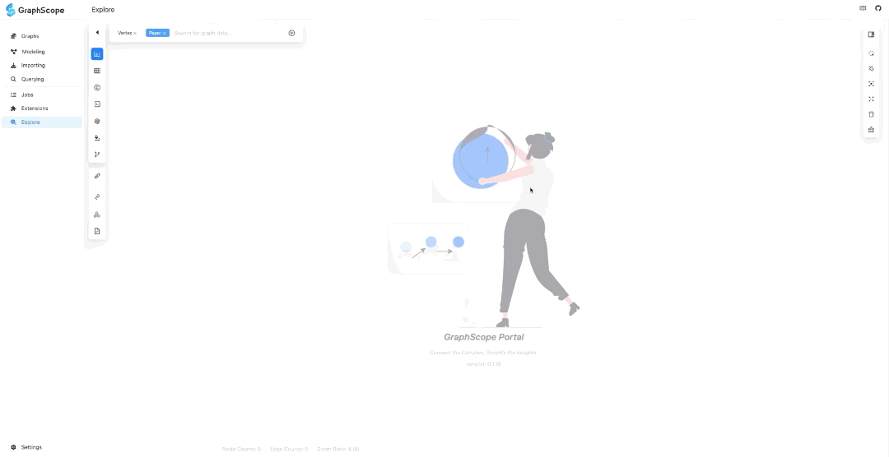
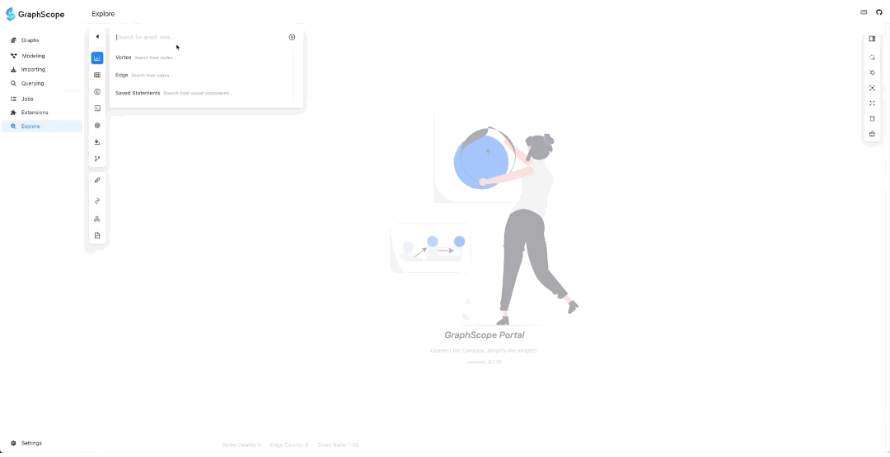
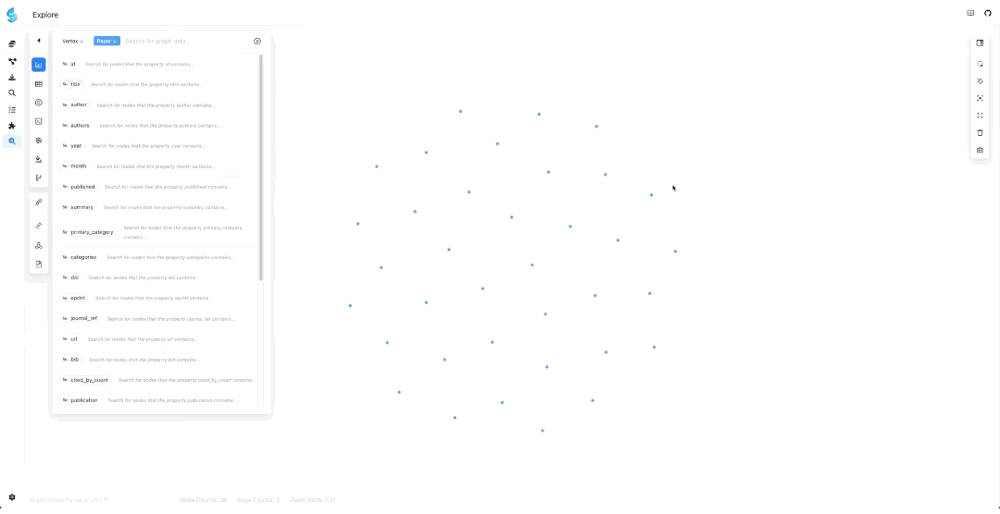
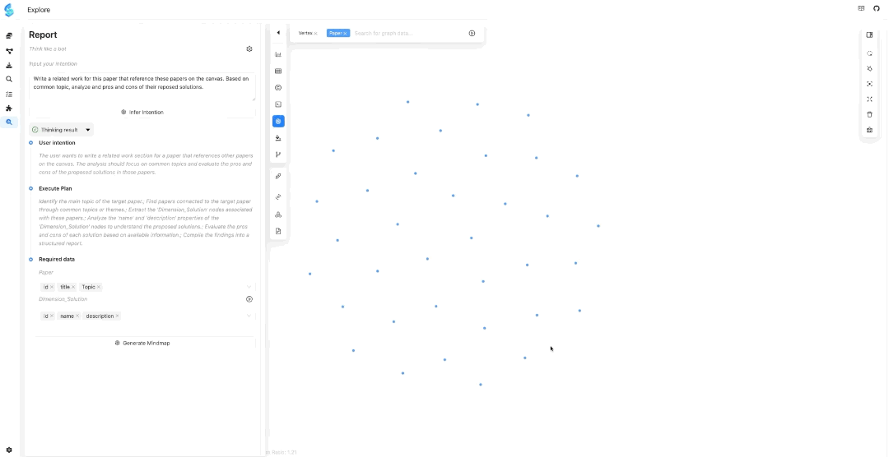

# Tutorial of Writing Related work
In this tutorial, we will guide you through the process of writing the "Related Work" section of a draft paper using Graphy. Before you begin, ensure that you have gathered and prepared all the necessary paper PDFs for this section. If you do not already have these materials, we have provided the related work [PDFs](../samples/relgo_related_work.zip) from our [RelGO](https://dl.acm.org/doi/10.1145/3698828) paper for testing purposes. We have also prepared the [graph data](../samples/relgo_graph.zip) extracted from RelGO's related work, enabling you to skip ahead to [Step 3](#step-3-import-the-graph-data-into-online-surveyor) in this tutorial.

## Prerequisites

- We have tested the code on MacOS 14 & 15 and Ubuntu 20.04. The code has better compatibility with Unix and Linux systems. Windows 10 & 11 users are recommended to use WSL2 or a virtual machine.

- If you have not used Graphy before, you will have to prepare for the installation of the Graphy package.
  - Make sure your Python version >= 3.9 and < 3.13.
  - Make sure you are in the root directory of the Graphy project.
  - Install Python Dependencies

    ```bash
    python -m venv venv
    source venv/bin/activate
    pip install -r requirements.txt
    ```

  - Setting Python Environment: We have not built and installed the python package yet. So, it is important to add the path to the python package to the `PYTHONPATH` before running the server.

    ```bash
    export PYTHONPATH=$PYTHONPATH:$(pwd)
    ```

## Step 1: Extract Papers

Suppose that you have already prepared a collection of papers for drafting the ``Related Work'' section
for your paper. Prepare the paper PDF files in a directory, and run:

```bash
python paper_scrapper.py  \
	-w 4 \
	-f config/workflow_inspector.json \
 	<path_to_your_papers>
```

> **Note**: A workflow that includes only `Inspection` is given in `config/workflow_inspector.json`. In this task, since you have already identified all the required papers, there is no need to use `Navigation` to crawl the references of the papers.


## Step 2: Build the Graph Data
After completing paper scrapping, you will have the raw extracted data maintained under
[WF_OUTPUT_DIR](config/__init__.py)/test_paper_inspector. Then you can build the graph data by running:

```bash
python graph_builder.py \
  -i WF_OUTPUT_DIR/test_paper_inspector \
  -o <your_output_dir>
```

## Step 3: Import the Graph Data into Online Surveyor

The simplest way to try out the **Online Surveyor** is via the [Vercel deployment](https://gsp.vercel.app/).
> **Note:** A VPN may be necessary to access this page from China mainland. Make sure to enable the experimental **Explore** feature in the portal configuration, as shown below:


Then follow the instructions below to import the above graph data



## Step 4: Exploring all Papers

In the graph exploration search dropdown, select "Paper". Then return to the search box, and click "Enter" while the input is empty. This will add all paper nodes to the "Present" canvas.



## Step 5: Prompt to Generate Report

Click the "GPT" logo for "Report Generation" (please select an LLM and configure your API key), enter your intent (prompt), and the LLM will recommend the required data from the graph based on your intent. Below is how we prompt Graphy to generate the
"Related Work" section of our RelGO paper:

---

> Please write a "Related Work" section for our RelGO paper titled "Towards a Converged Relational-Graph Optimization Framework". Reference the papers presented on the canvas. Organize these papers into a maximum of four distinct and coherent common TOPICS. For each topic, conduct an in-depth analysis of the solutions proposed in those papers and clearly elucidate how they may have connections with our RelGO paper. The summary of RelGO paper (which is copied from the paper) is given as follows:

> The recent ISO SQL:2023 standard adopts SQL/PGQ (Property Graph Queries), facilitating graph-like querying within relational databases. This advancement, however, underscores a significant gap in how to effectively optimize SQL/PGQ queries within relational database systems. To address this gap, we extend the foundational SPJ (Select-Project-Join) queries to SPJM queries, which include an additional matching operator for representing graph pattern matching in SQL/PGQ. Although SPJM queries can be converted to SPJ queries and optimized using existing relational query optimizers, our analysis shows that such a graph-agnostic method fails to benefit from graph-specific optimization techniques found in the literature. To address this issue, we develop a converged relational-graph optimization framework called RelGo for optimizing SPJM queries, leveraging joint efforts from both relational and graph query optimizations. Using DuckDB as the underlying relational execution engine, our experiments show that RelGo can generate efficient execution plans for SPJM queries.

---



## Step 6: Check the Data Recommended by the LLM

Check the data recommended by the LLM, adjust the attributes of paper node, and add dimension nodes (make sure to add dimension nodes here, otherwise the LLM will make up information if it doesn't have the corresponding data!!).

---
> In the above prompt, since we intend for the LLM to organize the papers based on specific topics, it is essential to have the "Topic" attribute associated with each paper. Besides the "Topic" attribute, other attributes like "Title", "Summary", and "Authors" can also be considered. This will provide a more comprehensive understanding of each paper.

> Furthermore, as our focus is on the solutions presented in the papers, it is crucial to interact with the relevant features in the system. To do this, click on the button labeled ​**"Dimension_Solution"**​ (note that this option should have been recommended by the LLM). This action will add the "Solution" dimension node to the canvas, allowing for a detailed analysis of the solutions offered by each paper. If the "Dimension_Solution" button is not recommended by the LLM, it may be necessary to regenerate the prompt or adjust the parameters to ensure that the desired functionality is available.

---



## Step 7: Review the Generated Mindmap

Check the corresponding node data in the graph through the generated mindmap. Once you confirm there are no issues, click "Generate Report".


## Step 8: Write the Related Work
After the report is generated, you can review the report and download the corresponding .tex (Markdown) and .bib files.


