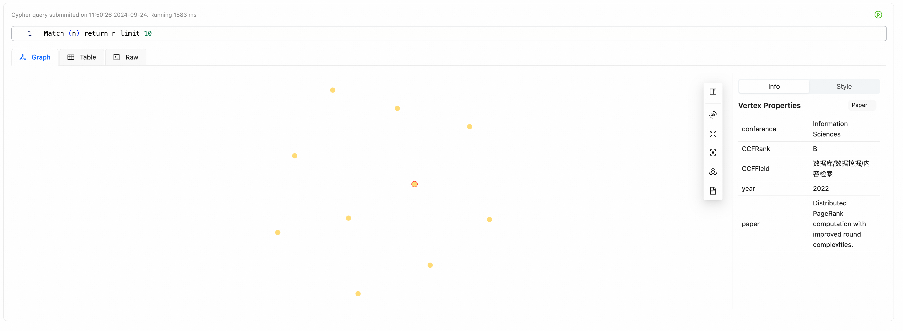

## Introduction

`gs-visua-tool` is a Python tool based on the GraphScope portal. You can specify the query endpoint to perform interactive queries and display graph visualizations.



## Quick Start

- install

```bash
pip install gs-visual-tool
```

- `python index.py`

```python
# index.py
import gs_visual_tool
gs_visual_tool.querying()
```

- visit: http://127.0.0.1:9999

## Development

- install deps

```bash
python -m venv .venv
source .venv/bin/activate
pip install -e .
```

- run demo

```bash
python demo/app.py
```

## Deployment

```bash
pip install build
python -m build
twine upload dist/*
```
